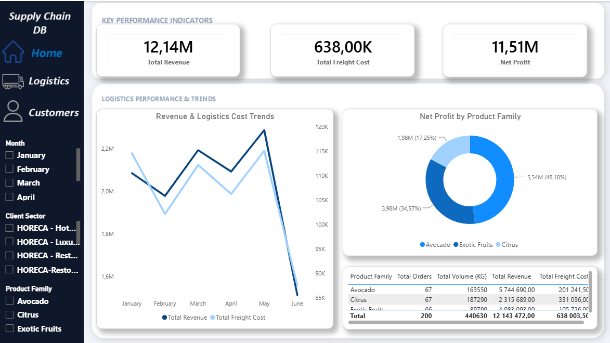
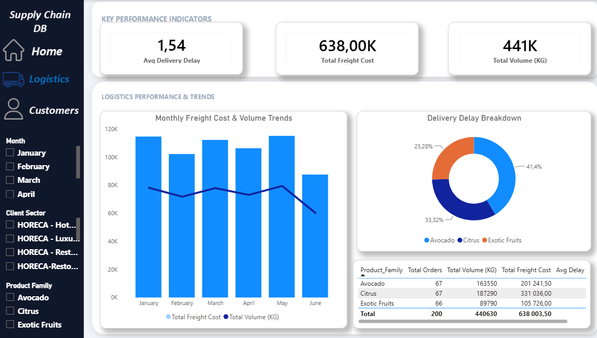
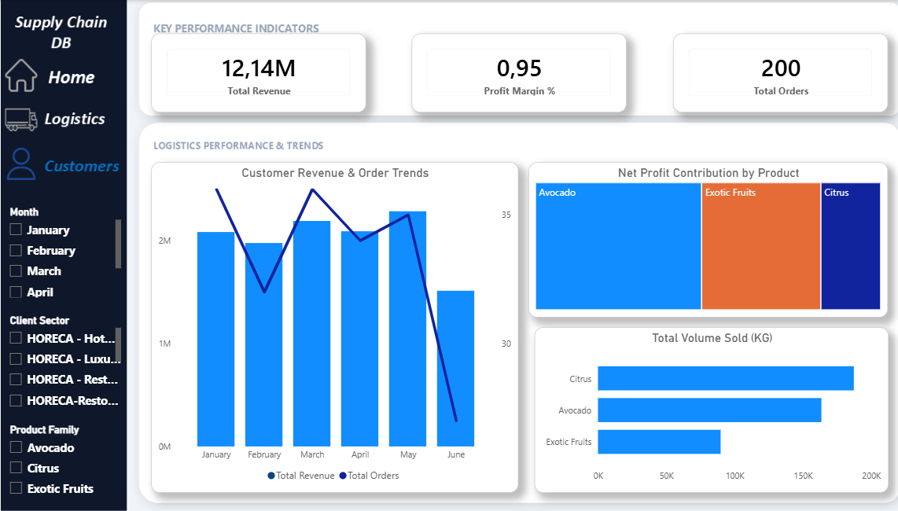

# 📊 Premium Supply Chain & Logistics Analytics Dashboard
An interactive, high-performance Power BI dashboard optimized for comprehensive **Logistics & Customer Operations** analysis. This project delivers an enterprise-grade UI/UX layout and an optimized data model designed to drive data-backed supply chain decisions.

---

## 🚀 Live Visual Previews

### 1. Home Dashboard
*Fully tailored interactive navigation portal with executive-level metric callouts.*

### 2. Logistics Performance & Trends
*In-depth volumetric analysis, freight cost distribution, and volume trends.*

### 3. Customer Revenue & Orders Trends
*Granular customer breakdown, net profit contributions, and regional distribution.*

---

## 🧠 Data Architecture & Modeling
The solution is structured around an optimized **Star Schema** to ensure fast query rendering and clear separation of contexts:
*   **Fact Table:** `Fact_Sales_Transactions` (Core transactional logs, orders, and fulfillment statuses).
*   **Dimension Tables:** 
    *   `Dim_Clients_Costs` (Client master data, locations, structural hubs, and freight cost attributes).
    *   `Dim_Calendar` (Time intelligence dimension created using explicit DAX expressions).

---

## 📈 Key Metrics & DAX Implementation
The underlying calculations utilize robust DAX logic to allow effortless slice-and-dice operations. Key measures implemented include:

*   **Total Revenue:** Dynamic summation of transaction values.
*   **Net Profit Contribution:** Cross-table evaluation of revenue versus regionalized freight costs.
*   **Volumetric Distribution:** Order volume analysis aggregated across multiple regional hubs (*Casablanca-Hub, North-Hub, South-Hub*).
*   **Fulfillment Analysis:** Tracking order progression across multiple logistics cycles (*Delivered, Pending, Canceled*).

---

## 💎 UI/UX & Design Highlights
*   **Left-Rail Navigation:** Professional left-hand navigation bar imitating modern enterprise SaaS software.
*   **Clean Contrast Layout:** Muted light backgrounds paired with strategic accent highlights to enhance visual hierarchy.
*   **Responsive Tooltips & Cross-filtering:** Fully interactive visual components ensuring a frictionless analytical experience.

---

## 📁 Repository Structure
*   `*.pbix` - Core Power BI Desktop application file containing data models and reports.
*   `*.xlsx` - Underlying structured Supply Chain master database.
*   `images/` - Visual high-definition portfolio assets.

---
*Developed by Fatima, Supply Chain Data Analyst Specialized in Power BI & Logistics Analytics.*
